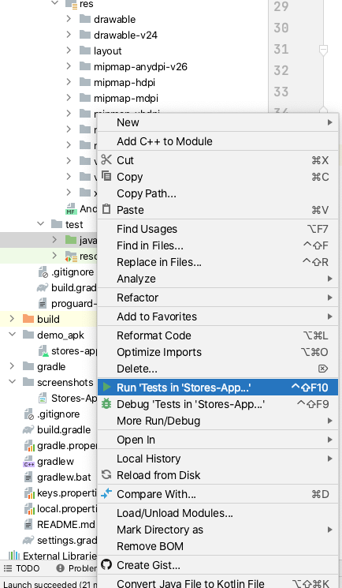

<h1 align="center">Stores</h1>

  
This application is built to get the list of nearby stores based on user current location. 
As a result it will help user to pick pr choose the store which is the most convenient one based on his/her preferences (reachable by car, by foot)

  
  

## Download
Go to the [Demo APK](https://github.com/yash786agg/Stores-App/tree/master/demo_apk) to download the latest APK.

## Tech stack & Open-source libraries
- Minimum SDK level 24
- [Kotlin](https://kotlinlang.org/) based + [Coroutines](https://github.com/Kotlin/kotlinx.coroutines) for asynchronous.
- [Dagger-Hilt](https://developer.android.com/training/dependency-injection/hilt-android#kotlin) for dependency injection.
  - Hilt Data Binding - Implementing a binding adapter using the Android Data Binding Library.
- JetPack
  - LiveData - notify domain layer data to views.
  - Flow - dispose of observing data when lifecycle state changes.
  - ViewModel - UI related data holder, lifecycle aware.
- Architecture
  - MVVM Architecture (View - DataBinding - ViewModel - Model)
- [Retrofit2 & OkHttp3](https://github.com/square/retrofit) - construct the REST APIs and paging network data.
- [Moshi](https://github.com/square/moshi) - Moshi is a modern JSON library for Android, Java and Kotlin. It makes it easy to parse JSON into Java and Kotlin classes.
- [Android Architecture Components](https://developer.android.com/topic/libraries/architecture/index.html) - An MVVM architecture.
- [Paging3.0](https://developer.android.com/topic/libraries/architecture/paging/v3-overview) - A Paging Library helps you load and display small chunks of data at a time.   
- [Mockito](http://site.mockito.org/) - Unit Testing.
- [Dark Mode](https://developer.android.com/guide/topics/ui/look-and-feel/darktheme) - Application supports both Light and Dark Mode/Theme.

Above Features are used to make code simple, generic, understandable, clean and easily maintainable
for future development.

## Automated test

To run Android Unit tests in a directory, right-click on the directory and select Run tests

## Running and Building the application

You can run the app on a real device or an emulator.

* __[Run on a real device](https://developer.android.com/training/basics/firstapp/running-app#RealDevice)__
* __[Run on an emulator](https://developer.android.com/training/basics/firstapp/running-app#Emulator)__

# Prerequisites
* __Android Studio Arctic Fox | 2020.3.1__
* __Gradle version 7.0.4__
* __Kotlin version 1.5.31__
* __Android Device with USB Debugging Enabled__

# Built With

* __[Android Studio](https://developer.android.com/studio/index.html)__ - The Official IDE for Android
* __[Kotlin](https://developer.android.com/kotlin)__ - Language used to build the application
* __[Gradle](https://gradle.org)__ - Build tool for Android Studio
